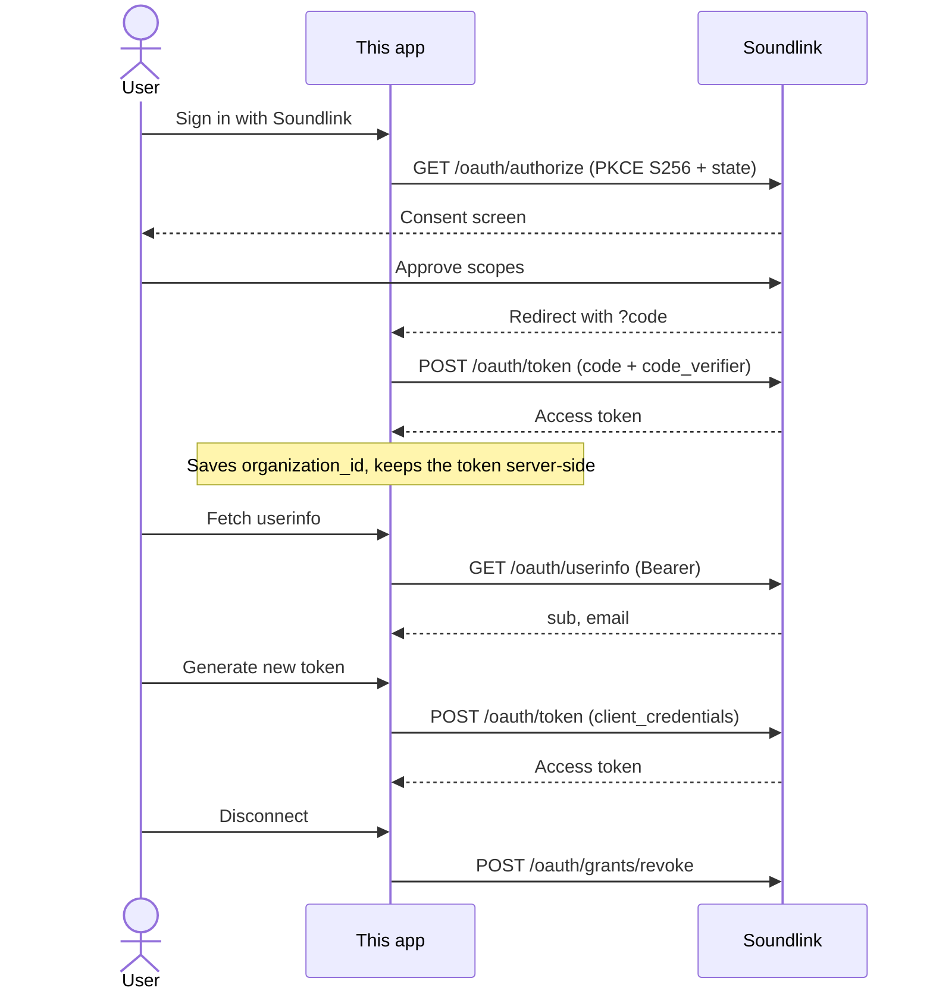

# Soundlink OAuth Example

A reference Next.js app for connecting a Soundlink organization with Authorization Code + PKCE.

## Flow



## Application flow

Server-side steps only. The browser never sees `client_secret`, the PKCE verifier, or access tokens.

### 1. Start connect — PKCE + redirect

`GET /api/oauth/connect` generates `state` and a PKCE verifier, stores them in a signed httpOnly cookie, then redirects to Soundlink.

```ts
// app/api/oauth/connect/route.ts
const state = generateState();
const codeVerifier = generateCodeVerifier();
const codeChallenge = generateCodeChallenge(codeVerifier);

await setPkceCookie({ state, codeVerifier }, config.sessionSecret);
return NextResponse.redirect(
  buildAuthorizeUrl(config, { state, codeChallenge }),
);
```

```ts
// lib/oauth/client.ts — authorize URL
url.searchParams.set("response_type", "code");
url.searchParams.set("code_challenge", params.codeChallenge);
url.searchParams.set("code_challenge_method", "S256");
```

### 2. Callback — exchange code for token

`GET /api/oauth/callback` consumes the PKCE cookie, checks `state`, and exchanges `code` + `code_verifier` for an access token (server-side only).

```ts
// app/api/oauth/callback/route.ts
const pkce = await consumePkceCookie(config.sessionSecret);
if (!pkce || pkce.state !== state) {
  return homeRedirect({ error: "invalid_state" });
}

const token = await exchangeAuthorizationCode(config, {
  code,
  codeVerifier: pkce.codeVerifier,
});
```

```ts
// lib/oauth/client.ts
const body = new URLSearchParams({
  grant_type: "authorization_code",
  code: params.code,
  redirect_uri: config.redirectUri,
  client_id: config.clientId,
  code_verifier: params.codeVerifier,
});
```

### 3. Persist org metadata, keep token server-side

`organization_id` and `grant_id` come from JWT claims. The access token stays in an in-memory server store; only ids/scopes/expiry go back to the browser.

```ts
// app/api/oauth/callback/route.ts
const claims = decodeJwtPayload(token.access_token);
const organizationId = claims?.organization_id as string | undefined;
const grantId = claims?.grant_id as string | undefined;

saveAccessToken(organizationId, {
  accessToken: token.access_token,
  scopes,
  expiresInSeconds: token.expires_in,
});

return homeRedirect({
  connected: organizationId,
  ...(grantId ? { grant: grantId } : {}),
});
```

There is no refresh token. When this consent token expires (~1h), reconnect is required to call userinfo again.

### 4. Fetch userinfo — authorization-code token only

`POST /api/oauth/userinfo` uses the stored consent token. Soundlink rejects client-credentials tokens here (`403 access_denied`).

```ts
// app/api/oauth/userinfo/route.ts
const token = getAccessToken(organizationId);
const result = await fetchUserinfo(getOAuthConfig(), token.accessToken);
```

```ts
// lib/oauth/client.ts
fetch(`${config.apiBaseUrl}/api/v1/oauth/userinfo`, {
  headers: { Authorization: `Bearer ${accessToken}` },
});
```

### 5. Mint a machine token — client credentials

`POST /api/oauth/token` authenticates as the app (`client_id` + `client_secret`) for a given `organization_id`. Requires an existing grant from step 2. The route returns claims/expiry, never the raw token.

```ts
// lib/oauth/client.ts
const body = new URLSearchParams({
  grant_type: "client_credentials",
  client_id: config.clientId,
  client_secret: config.clientSecret,
  organization_id: organizationId,
  scope: config.scopes,
});
```

### 6. Disconnect — revoke grant + clear local tokens

`POST /api/oauth/disconnect` revokes the grant at Soundlink, then drops both the consent token and any cached client-credentials token.

```ts
// app/api/oauth/disconnect/route.ts
if (grantId) {
  await revokeGrant(getOAuthConfig(), grantId);
}
clearAccessToken(organizationId);
clearToken(organizationId);
```

```ts
// lib/oauth/client.ts
POST /api/v1/oauth/grants/revoke
client_id + client_secret + grant_id
```

Revocation stops **new** tokens. An already-issued access token remains valid until it expires.

## Setup

**Prerequisites**

- Node 20+
- A Soundlink OAuth client with `authorization_code` and `client_credentials` grant types, and
  redirect URI `http://localhost:3005/api/oauth/callback`
- `THIRD_PARTY_INTEGRATIONS_ENABLED` enabled for the target organization

**Run**

1. Copy the environment template:

   ```bash
   cp .env.example .env.local
   ```

2. Fill in `SOUNDLINK_CLIENT_ID`, `SOUNDLINK_CLIENT_SECRET` and `SESSION_SECRET`.

3. Install and start:

   ```bash
   npm install
   npm run dev
   ```

4. Open [http://localhost:3005](http://localhost:3005) and click **Sign in with Soundlink**.
