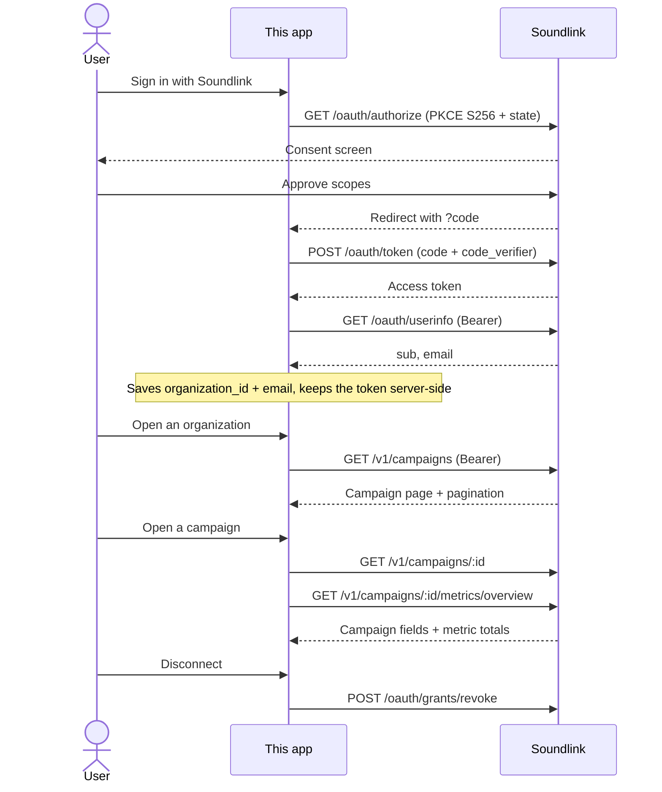

# Soundlink OAuth Example

A reference Next.js app for connecting a Soundlink organization with Authorization Code + PKCE.

## Flow



## What the demo shows

Three pages, each one step further into an organization's data.

**`/` — organizations.** A tile per connected organization: short id, the email userinfo
returned, and Disconnect. The dashed tile starts the consent flow. Connected organizations
live in localStorage, so the list is per browser — which is the point: after consent, the
`organization_id` is the only thing a partner has to keep.

**`/orgs/<organization id>` — campaigns.** The organization's campaigns, ten per page:
short id, status, platform, daily and total budget, duration, created date. Previous/Next
page through `totalCount`. Clicking a campaign id opens it.

**`/orgs/<organization id>/campaigns/<campaign id>` — campaign and metrics.** The campaign's
own fields, including `strategyType`, which the list summary omits. Below that, metric totals
for campaign start through today: listeners, streams, followers, impressions, ad and link
clicks, media/total spend, fees, and the derived `cpl`, `cpf` and streams-per-listener.
`impressions`, `ad_clicks` and `link_clicks` are nullable and show as `—`.

The two sections load independently, so a token holding `campaigns:read` but not
`metrics:read` shows the campaign and an explanation in place of the metrics.

## Endpoints and scopes

| Soundlink endpoint | Scope | Reached through |
|---|---|---|
| `GET /api/oauth/authorize` | — | `/api/oauth/connect` |
| `POST /api/v1/oauth/token` (`authorization_code`) | — | `/api/oauth/callback` |
| `POST /api/v1/oauth/token` (`client_credentials`) | — | minted for the reads below |
| `GET /api/v1/oauth/userinfo` | `openid`, `email` | `/api/oauth/userinfo` |
| `GET /v1/campaigns` | `campaigns:read` | `/api/campaigns` |
| `GET /v1/campaigns/:id` | `campaigns:read` | `/api/campaigns/:id` |
| `GET /v1/campaigns/:id/metrics/overview` | `metrics:read` | `/api/campaigns/:id/metrics` |
| `POST /api/v1/oauth/grants/revoke` | — | `/api/oauth/disconnect` |

The OAuth endpoints live under `/api/v1/`, the campaign resources under `/v1/` — both on
`SOUNDLINK_API_BASE_URL`. Every one is called from the server, so no token reaches the
browser.

## Application flow

Server-side steps only. The browser never sees `client_secret`, the PKCE verifier, or access tokens.

### 1. Start connect — PKCE + redirect

`GET /api/oauth/connect` generates `state` and a PKCE verifier, stores them in a signed httpOnly cookie, then redirects to Soundlink.

```ts
// app/api/oauth/connect/route.ts
const state = generateState();
const codeVerifier = generateCodeVerifier();
const codeChallenge = generateCodeChallenge(codeVerifier);

await setPkceCookie({ state, codeVerifier }, config.sessionSecret);
return NextResponse.redirect(
  buildAuthorizeUrl(config, { state, codeChallenge }),
);
```

```ts
// lib/oauth/client.ts — authorize URL
url.searchParams.set("response_type", "code");
url.searchParams.set("code_challenge", params.codeChallenge);
url.searchParams.set("code_challenge_method", "S256");
```

### 2. Callback — exchange code for token

`GET /api/oauth/callback` consumes the PKCE cookie, checks `state`, and exchanges `code` + `code_verifier` for an access token (server-side only).

```ts
// app/api/oauth/callback/route.ts
const pkce = await consumePkceCookie(config.sessionSecret);
if (!pkce || pkce.state !== state) {
  return homeRedirect({ error: "invalid_state" });
}

const token = await exchangeAuthorizationCode(config, {
  code,
  codeVerifier: pkce.codeVerifier,
});
```

```ts
// lib/oauth/client.ts
const body = new URLSearchParams({
  grant_type: "authorization_code",
  code: params.code,
  redirect_uri: config.redirectUri,
  client_id: config.clientId,
  code_verifier: params.codeVerifier,
});
```

### 3. Persist org metadata and identity, keep token server-side

`organization_id` and `grant_id` come from JWT claims. The access token stays in an in-memory server store; only ids/scopes/expiry go back to the browser.

```ts
// app/api/oauth/callback/route.ts
const claims = decodeJwtPayload(token.access_token);
const organizationId = claims?.organization_id as string | undefined;
const grantId = claims?.grant_id as string | undefined;

saveAccessToken(organizationId, {
  accessToken: token.access_token,
  scopes,
  expiresInSeconds: token.expires_in,
});

return homeRedirect({
  connected: organizationId,
  ...(grantId ? { grant: grantId } : {}),
});
```

### 4. Read the email — authorization-code token only

Back on the page, the returning organization is read once, while the consent token is still
fresh. `POST /api/oauth/userinfo` spends that token: userinfo requires
`grant_type=authorization_code`, so a client-credentials token is rejected here
(`403 access_denied`).

```ts
// components/connected-orgs.tsx
void fetchOrgProfile(connected).then((profile) => {
  if (profile) setOrgProfile(connected, profile);
});
```

```ts
// app/api/oauth/userinfo/route.ts
const token = getAccessToken(organizationId);
const result = await fetchUserinfo(getOAuthConfig(), token.accessToken);
```

The email is stored beside the `organization_id` so each tile can name itself with no
request on render. There is no refresh token: once this token expires (~1h) reconnecting is
the only way to read userinfo again — which is why it is read at connect time rather than on
demand.

### 5. List campaigns — a minted token, on a public-API resource

`/orgs/<organization id>` shows that organization's campaigns. `GET /api/campaigns` proxies
the request so the token stays on the server, clamping `page`/`pageSize` to the bounds the
endpoint accepts.

The token here is **minted**, not the one from consent: `client_id` + `client_secret` +
the stored `organization_id`, cached until it is nearly expired and then re-minted. That is
what makes the stored organization id valuable — consent tokens last an hour and cannot be
refreshed, so a page depending on one would break shortly after connecting.

```ts
// app/api/campaigns/route.ts
const { accessToken } = await getClientCredentialsToken(config, organizationId);
```

```ts
// lib/oauth/client.ts
const url = new URL(`${config.apiBaseUrl}/v1/campaigns`);
url.searchParams.set("page", String(params.page));
url.searchParams.set("pageSize", String(params.pageSize));

fetch(url, { headers: { Authorization: `Bearer ${accessToken}` } });
```

Needs `campaigns:read`; a token without it gets `403`. Items and pagination arrive under
`data`. If the client is not allowed the `client_credentials` grant, the route falls back to
the consent token so the page still works for the hour after connecting.

### 6. Campaign detail + metrics — two scopes, two requests

`/orgs/<organization id>/campaigns/<campaign id>` reads the campaign and its metric totals
through `/api/campaigns/:id` and `/api/campaigns/:id/metrics`.

The two are requested in parallel and rendered independently, because they need different
scopes — `campaigns:read` and `metrics:read`. A token allowed one and refused the other shows
what it can rather than failing both.

```ts
// lib/oauth/client.ts
`${config.apiBaseUrl}/v1/campaigns/${campaignId}`;
`${config.apiBaseUrl}/v1/campaigns/${campaignId}/metrics/overview`;
```

Metrics dates are optional and validated as `YYYY-MM-DD` before being forwarded; omitted, the
endpoint uses campaign start through today. `impressions`, `ad_clicks` and `link_clicks` are
nullable and render as `—`.

### 7. Disconnect — revoke grant + clear the local entry

`POST /api/oauth/disconnect` revokes the grant at Soundlink, then drops both tokens held for
the organization. The browser removes the organization from localStorage afterwards.

```ts
// app/api/oauth/disconnect/route.ts
if (grantId) {
  await revokeGrant(getOAuthConfig(), grantId);
}
clearAccessToken(organizationId);
clearToken(organizationId);
```

Clearing the minted token matters: revocation only stops **new** tokens, so a cached one
would otherwise keep working until it expired.

```ts
// lib/oauth/client.ts
POST /api/v1/oauth/grants/revoke
client_id + client_secret + grant_id
```

Revocation stops **new** tokens. An already-issued access token remains valid until it expires.

## Setup

**Prerequisites**

- Node 20+
- A Soundlink OAuth client with the `authorization_code` and `client_credentials` grant
  types, and redirect URI `http://localhost:3005/api/oauth/callback`
- `THIRD_PARTY_INTEGRATIONS_ENABLED` enabled for the target organization
- The client allowed the scopes it asks for — `SOUNDLINK_SCOPES` defaults to
  `openid email campaigns:read metrics:read`, and the campaign pages need the last two

**Run**

1. Copy the environment template:

   ```bash
   cp .env.example .env.local
   ```

2. Fill in `SOUNDLINK_CLIENT_ID`, `SOUNDLINK_CLIENT_SECRET` and `SESSION_SECRET`.

3. Install and start:

   ```bash
   npm install
   npm run dev
   ```

4. Open [http://localhost:3005](http://localhost:3005) and connect an organization, then
   click through it to a campaign — see [What the demo shows](#what-the-demo-shows).
